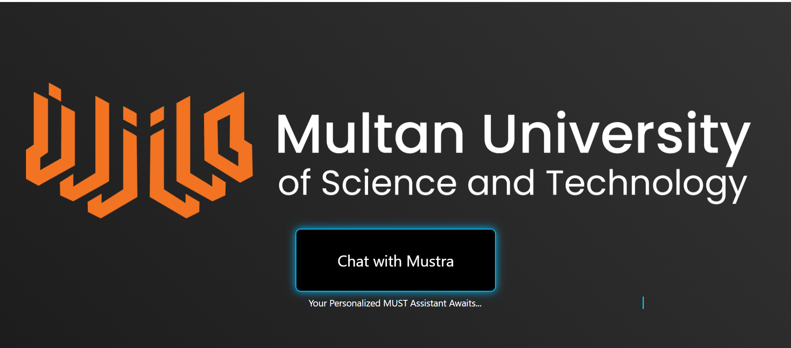
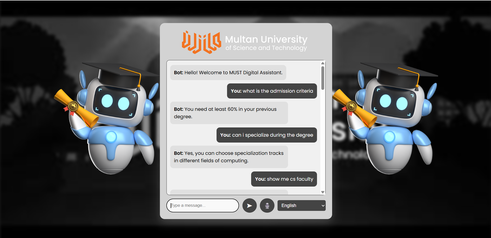

<div align="center">

# 🤖 MUSTRA CHATBOT
## **Multan University of Science and Technology**


> **An intelligent, multilingual university chatbot powered by Semantic Search, FAISS, and Flask**

[](https://python.org)
[](https://flask.palletsprojects.com/)
[](https://faiss.ai/)
[](https://www.sbert.net/)
[](https://sqlite.org)
[](LICENSE)

---

</div>

## 📌 Table of Contents

- [Overview](#-overview)
- [Features](#-features)
- [Tech Stack](#-tech-stack)
- [Project Structure](#-project-structure)
- [Installation & Setup](#-installation--setup)
- [Configuration](#-configuration)
- [API Endpoints](#-api-endpoints)
- [How It Works](#-how-it-works)
- [Screenshots](#-screenshots)
- [Contributing](#-contributing)
- [License](#-license)

---

## 🌐 Overview

**Mustra Chatbot** is a full-featured AI-powered chatbot built specifically for **Multan University of Science and Technology (MUST)**. It helps students, faculty, and visitors get instant answers to university-related queries — including admissions, faculty information, departments, campus gallery, and more.

The system uses **semantic similarity search** via FAISS and SentenceTransformers to match user questions against a curated knowledge base (CSV), and returns the most contextually relevant answer — even when phrasing differs from stored questions.

It also supports **multilingual responses** using Google Translate API, making it accessible to Urdu and other language speakers.

---

## ✨ Features

| Feature | Description |
|---|---|
| 🔐 **User Authentication** | Secure signup/login with hashed passwords using Werkzeug |
| 🤖 **Semantic Chatbot** | FAISS + SentenceTransformers for intelligent Q&A matching |
| 🌍 **Multilingual Support** | Translates bot responses to Urdu, Arabic, French, and more |
| 🖼️ **Campus Gallery** | Keyword-based filtering and display of campus photos from SQLite |
| 👩‍🏫 **Faculty Directory** | Search faculty by name, title, department, or email |
| 🔄 **Live Data Reload** | Hot-reload CSV and FAISS index without restarting the server |
| 🛡️ **Session-based Access** | All chat and gallery routes are protected behind login |
| 💾 **SQLite Backend** | Lightweight, zero-config database for users, gallery, and faculty |

---

## 🛠️ Tech Stack

### Backend
- **Python 3.10+**
- **Flask** — Web framework and routing
- **SQLite3** — Relational database for users, gallery, faculty
- **Werkzeug** — Password hashing and security

### AI / NLP
- **SentenceTransformers** (`all-MiniLM-L6-v2`) — Converts questions to dense semantic vectors
- **FAISS** (`faiss-cpu`) — Ultra-fast vector similarity search
- **NumPy** — Embedding array manipulation

### Data & Translation
- **Pandas** — CSV parsing and data loading
- **Google Translate API** (unofficial `translate.googleapis.com`) — Multilingual response translation

### Frontend
- **Jinja2 Templates** (Flask)
- HTML/CSS/JavaScript (in `/templates` and `/static`)

---

## 📁 Project Structure

```
mustra-chatbot/
│
├── app.py                      # Main Flask application
├── static/
│   ├── data.csv                # Q&A knowledge base
│   ├── gallery/                # Campus image files
│   │   └── *.jpg / *.png
│   └── faculty/                # Faculty profile images
│       └── *.jpg / *.png
│
├── templates/
│   ├── index.html              # Main chat interface
│   ├── login.html              # Login page
│   └── signup.html             # Registration page
│
├── database.sqlite3            # SQLite database (users, gallery, faculty)
├── requirements.txt            # Python dependencies
└── README.md                   # This file
```

---

## ⚙️ Installation & Setup

### 1. Clone the Repository

```bash
git clone https://github.com/your-username/mustra-chatbot.git
cd mustra-chatbot
```

### 2. Create a Virtual Environment

```bash
python -m venv venv

# Activate (Windows)
venv\Scripts\activate

# Activate (Linux/Mac)
source venv/bin/activate
```

### 3. Install Dependencies

```bash
pip install -r requirements.txt
```

> If `faiss-cpu` fails, install it separately:
> ```bash
> pip install faiss-cpu --extra-index-url https://download.pytorch.org/whl/cpu
> ```

### 4. Prepare the Database

Make sure your `database.sqlite3` has the following tables:

```sql
-- Users table (auto-created on first run)
CREATE TABLE IF NOT EXISTS users (
    id INTEGER PRIMARY KEY AUTOINCREMENT,
    username TEXT NOT NULL,
    password TEXT NOT NULL
);

-- Campus gallery table
CREATE TABLE IF NOT EXISTS campus_gallery (
    id INTEGER PRIMARY KEY AUTOINCREMENT,
    name TEXT,
    image_filename TEXT
);

-- Faculty members table
CREATE TABLE IF NOT EXISTS faculty_members (
    id INTEGER PRIMARY KEY AUTOINCREMENT,
    name TEXT,
    title TEXT,
    email TEXT,
    image_filename TEXT
);
```

### 5. Prepare the CSV Knowledge Base

Your `static/data.csv` should follow this format:

```csv
Question,Answer
What is MUST?,Multan University of Science and Technology (MUST) is a public university located in Multan, Pakistan.
When was MUST established?,MUST was established in 2012.
How do I apply for admission?,Visit the official MUST website and fill out the online admission form during the open enrollment period.
...
```

### 6. Run the Application

```bash
python app.py
```

Open your browser and go to: **http://127.0.0.1:5000**

---

## 🔧 Configuration

Edit these variables at the top of `app.py` to match your local setup:

```python
# Path to your SQLite database
DATABASE_PATH = r"C:\path\to\your\database.sqlite3"

# Path to your Q&A CSV file
CSV_PATH = "static/data.csv"
```

> ⚠️ **Note:** The `DATABASE_PATH` currently uses an absolute Windows path. For portability, consider using:
> ```python
> import os
> DATABASE_PATH = os.path.join(os.path.dirname(__file__), "database.sqlite3")
> ```

---

## 📡 API Endpoints

| Method | Endpoint | Description | Auth Required |
|--------|----------|-------------|---------------|
| `GET` | `/` | Home / Chat interface | ✅ Yes |
| `GET` | `/login` | Login page | ❌ No |
| `POST` | `/login` | Authenticate user | ❌ No |
| `GET` | `/signup` | Registration page | ❌ No |
| `POST` | `/signup` | Register new user | ❌ No |
| `GET` | `/logout` | Log out and clear session | ✅ Yes |
| `POST` | `/chat` | Send a message, get a response | ✅ Yes |
| `GET` | `/reload` | Reload CSV + FAISS index live | ✅ Yes |

### `/chat` — Request & Response Format

**Request:**
```json
{
  "message": "Who are the CS faculty members?",
  "language": "en"
}
```

**Response (text):**
```json
{
  "response": "Here are the faculty members you asked about:"
}
```

**Response (with faculty):**
```json
{
  "response": "Here are the faculty members you asked about:",
  "faculty": [
    {
      "name": "Dr. Ahmed Khan",
      "title": "Associate Professor, CS",
      "email": "ahmed.khan@must.edu.pk",
      "image": "/static/faculty/ahmed_khan.jpg"
    }
  ]
}
```

**Response (with gallery):**
```json
{
  "response": "Here are some photos of our university:",
  "images": [
    {
      "name": "Main Gate",
      "image": "/static/gallery/main_gate.jpg"
    }
  ]
}
```

---

## 🧠 How It Works

```
User Input
    │
    ▼
[Keyword Detection]
    ├── "faculty / professor / lecturer" ──► Load Faculty from SQLite
    ├── "campus / photo / gallery"       ──► Load Gallery from SQLite
    └── (other)                          ──► FAISS Semantic Search
                                                    │
                                         [Encode input with SentenceTransformer]
                                                    │
                                         [Search FAISS index (L2 distance)]
                                                    │
                                         [Return best match if score ≤ 1.5]
                                                    │
                                         [Translate response via Google Translate]
                                                    │
                                              JSON Response
```

### Semantic Search Flow

1. On startup, all `Question` entries from `data.csv` are encoded into **384-dimensional vectors** using `all-MiniLM-L6-v2`
2. These vectors are stored in a **FAISS flat L2 index** in memory
3. When a user sends a message, it is encoded into a vector and the **nearest neighbor** is found
4. If the L2 distance score is **≤ 1.5**, the matched answer is returned; otherwise a fallback message is shown
5. The response is optionally **translated** to the selected language

---

## 📸 Screenshots

### 🏠 Landing Page — Chat with Mustra



> Dark-themed landing page with the official **MUST orange logo** and a glowing **"Chat with Mustra"** CTA button — _"Your Personalized MUST Assistant Awaits..."_

---

### 💬 Chat Interface — Live Conversation



> The main chat window featuring the **graduation robot mascot**, MUST header branding, real-time Q&A (admission criteria, specialization, CS faculty), and a **multilingual language selector**.

---

## 📦 requirements.txt

```txt
flask
pandas
numpy
faiss-cpu
sentence-transformers
werkzeug
requests
```

Install all at once:
```bash
pip install flask pandas numpy faiss-cpu sentence-transformers werkzeug requests
```

---

## 🤝 Contributing

Contributions are welcome! Here's how to get started:

1. **Fork** this repository
2. Create a new branch: `git checkout -b feature/your-feature-name`
3. Make your changes and **commit**: `git commit -m "Add: your feature description"`
4. **Push** to your fork: `git push origin feature/your-feature-name`
5. Open a **Pull Request**

Please make sure your code follows PEP8 style and includes comments where necessary.

---

## 🙏 Acknowledgements

- [Multan University of Science and Technology (MUST)](https://must.edu.pk)
- [Sentence Transformers by UKPLab](https://www.sbert.net/)
- [Facebook AI Research — FAISS](https://github.com/facebookresearch/faiss)
- [Flask Documentation](https://flask.palletsprojects.com/)

---

## 📄 License

This project is licensed under the **MIT License** — see the [LICENSE](LICENSE) file for details.

---

<div align="center">

**Made with ❤️ for MUST — Multan University of Science and Technology**

*Empowering students with intelligent, instant access to university information*

</div>
